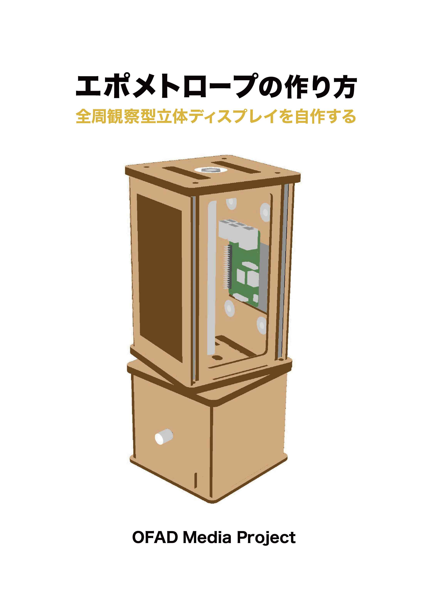

# エポメトロープとは
エポメトロープとは、デジタルファブリケーションで制作したパーツやオープンソースハードウェア、市販品を組み合わせて作ることができる全周観察型立体ディスプレイです。

# 紹介動画

# 仕組み

# 主な材料

# 作り方 
エポメトロープの制作手順については下記のドキュメントにまとめています。  
『エポメトロープの作り方ー全周觀察型立体ディスプレイを自作する』  
https://docs.google.com/document/d/19RMpfx-YfTb1uZXj3RErybrc5b69bqix4a3tBb6x_-0/edit?usp=sharing  

# アプリケーション開発
Movie converter for epometrope  
https://github.com/yutaka-miki/Movie-converter-for-epometrope  
    
epomeMoviePlayer  
https://github.com/yutaka-miki/epomeMoviePlayer  
  
epomeStreamDemo  
https://github.com/yutaka-miki/epomeStreamDemo  
  
epomeHLSResceiver  
https://github.com/yutaka-miki/epomeHLSResceiver  
  
# 作品  
Aqualium  
https://github.com/yutaka-miki/Aqualium

# OFAD Media Project
https://github.com/yutaka-miki/epometorope-hardware/blob/main/OFAD-Media-Project.md 
