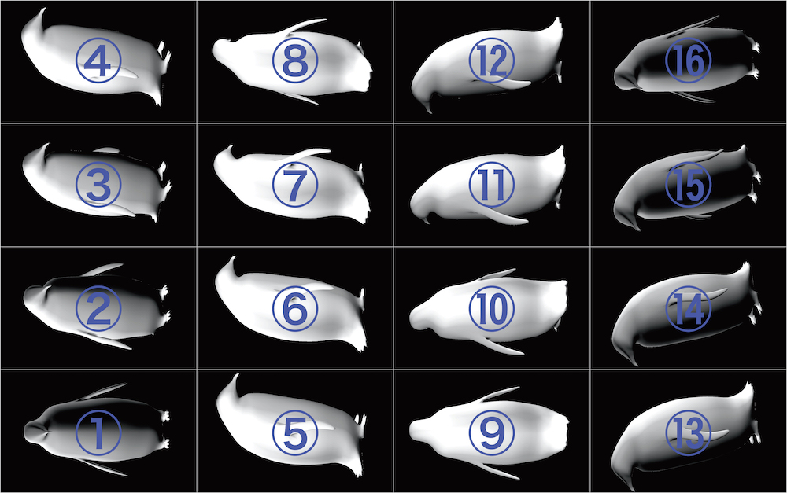
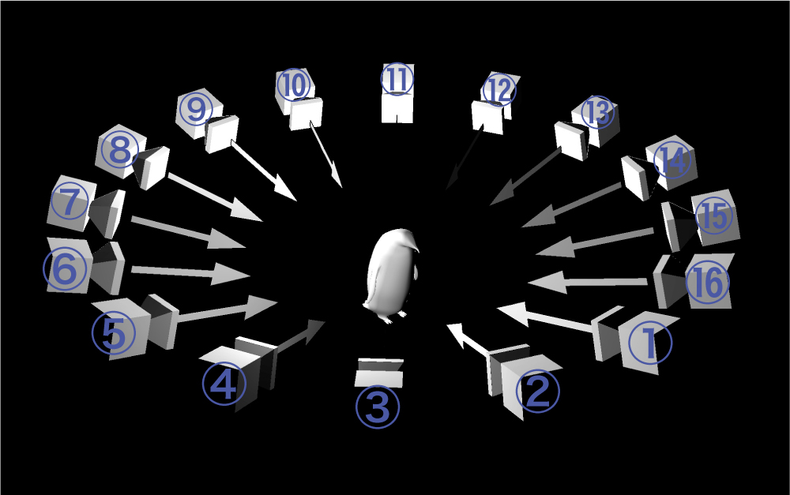
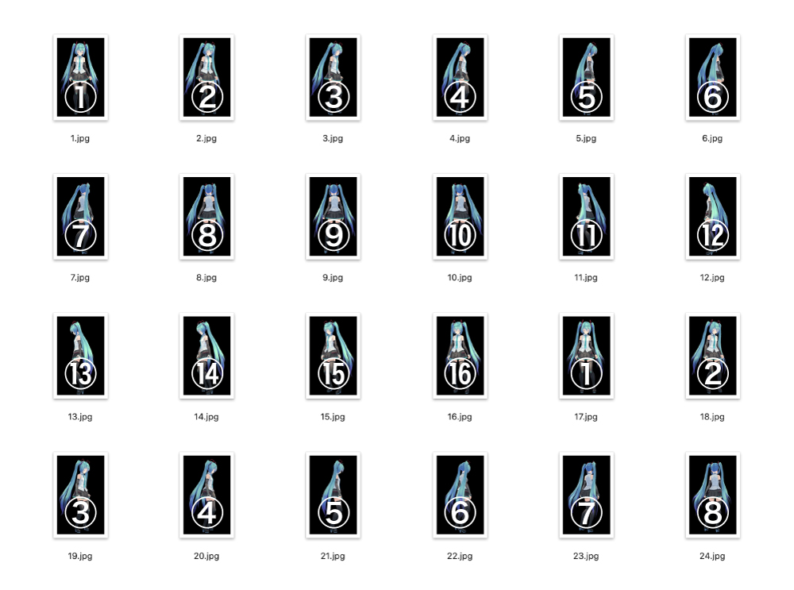

<!--| 注意 |
:----|
| 公開されているデータはβ版になります。実際に制作を検討する際は、設計者（yutaka-miki19(at)iamas.ac.jp）まで、ご一報お願いいたします。メールなどにて制作のサポートをします。こちらから一部パーツ（MDF、3Dプリントのパーツなど）を提供した上で制作をしていただく、リモートワークショップを随時開催しています。 | -->
<!--
| お知らせ |
:----|
| こちらから一部パーツ（MDF、3Dプリントのパーツなど）を提供した上で制作をしていただく、リモートワークショップを随時開催しています。興味のある方は「yutaka-miki19(at)iamas.ac.jp」まで、ご連絡ください。 | 
-->
<!-- The published data is a beta version. If you want to make this product, please contact me (yutaka-miki19(at)iamas.ac.jp). I will support you by email.-->
  
# Epometrope (Ver1.0)
エポメトロープは、デジタルファブリケーションで制作したパーツや市販品を組み合わせて作ることができる**オープンソースの全周観察型立体ディスプレイです。「周囲360度すべての角度から観察できる立体像」を表示することができ、物理空間上に3DCGがあるかのように見せることができます。**  
    
エポメトロープには既存の<a rel="license" href="https://github.com/yutaka-miki/epometorope#%E5%85%A8%E5%91%A8%E8%A6%B3%E5%AF%9F%E5%9E%8B%E7%AB%8B%E4%BD%93%E3%83%87%E3%82%A3%E3%82%B9%E3%83%97%E3%83%AC%E3%82%A4" target="_blank"> #全周観察型立体ディスプレイ </a>  に比べて以下のような特徴があります。  
- 比較的低価格で制作することができ、個人で所有することができる。  
- 高速プロジェクタなどを必要とせず、機構がシンプルかつコンパクトになっている。
- Raspberry PiとArduinoを採用しているので、汎用性・拡張性が高い。  
- 解像度やフレームレートが低く、細かな表現に向かない。 
  
---
  
Epometrope is an **open-source, "3D display obserbal from all directions"** that can be created by combining parts made in digital fabrication and commercially available products.**It is possible to create a 3D image that can be observed from all angles of the surrounding 360 degrees. It can make it appear as if 3DCG exists in physical space.**   
  
Epometrope has the following features compared to existing <a rel="license" href="https://github.com/yutaka-miki/epometorope#%E5%85%A8%E5%91%A8%E8%A6%B3%E5%AF%9F%E5%9E%8B%E7%AB%8B%E4%BD%93%E3%83%87%E3%82%A3%E3%82%B9%E3%83%97%E3%83%AC%E3%82%A4" target="_blank"> #3D displays observable from all directions</a>.
  
- It can be produced at low cost and can be owned by the individual.
- The mechanism is simple and compact because it does not require a high-speed projector.
- It uses a Raspberry Pi and Arduino, making it highly versatile and expandable.
- The resolution and frame rate are low, so it is not suitable for detailed expressions.
  
## ライセンス
現在、エポメトロープのハードウェアの制作用データ・説明書及び関連するソフトウェアは下記のライセンスに則り公開されています。  
<a rel="license" href="https://creativecommons.org/licenses/by-sa/4.0/deed.ja" target="_blank"> Attribution-ShareAlike 4.0 International (CC BY-SA 4.0) </a>
  
## 紹介動画
※動画内のエポメトロープは展示のために表示部に塗装を施しています。  
https://youtu.be/bQH5cyU_22U   
  
    
https://youtu.be/xwzOMGTIUi8  
  
  
## 仕組み  
回転する表示部がセンサーにより自分の向いている方向を認識し、対応した角度の画像を表示します。これにより、 **エポメトロープの正面からみた時には正面の像が見え、左側から見れば左側の像が見えるようになります。** さらに、右目と左目に見える画像の角度や位置が異なることによる視差効果も生まれ、あたかも3DCGが中に入っているように見せることができるのです。  
  
 
  
## 材料   
オープンソースハードウェア（Raspberry Pi、Arduino）と通信販売やホームセンターなどで購入できる市販品で構成されています。  
・MDF  
・3Dプリンタ用フィラメント  
・Raspberry Pi 3b+ ×2  
・7inch Raspberry Pi LCD Touch Screen ×2  
・Arduino nano every ×2  
・ギアードモーター  
など  

## 作り方 
エポメトロープの制作手順については下記のドキュメントにまとめています。  
**『エポメトロープの作り方ー全周観察型立体ディスプレイを自作する』**   
https://docs.google.com/document/d/19RMpfx-YfTb1uZXj3RErybrc5b69bqix4a3tBb6x_-0/edit?usp=sharing  
  

## コンテンツ開発
コンテンツの開発手法について紹介します。  
現在、PC上で加工した **「専用2D映像」** をエポメトロープ内のRaspberryPiにコピーして **「3D映像」** として再生する方法を推奨しています。  
（鑑賞者に対してインタラクティブな作品を制作することも可能ではありますが、現在はまだ検証段階です。）

### 「専用2D映像」の制作方法  
まず制作する「専用2D映像」の概要について説明します。「専用2D映像」は（ほぼ）同時間に別々の視点（カメラ）から撮影された映像が並べられています。円環状に並べられた16の視点から撮影された映像が並べられています。映像が横向きになっているのはエポメトロープに取り付けられているRaspberry Piが横向きに取り付けられているためです。  

 
 
  
(1)素材となる3DCGアニメーションを制作します。以下の点に留意するとわかりやすく魅力的な立体映像になると思います。  
- コントラストをはっきりさせ、白に近い部分を作る、3D映像にしたときに視認しやすい。  
- ディスプレイの縦横比に合わせ縦長のオブジェクトが好ましい、3D映像にしたときに視認しやすい。  
- 立方体や球などの単純な立体や人や動物などの記号的に理解しやすいオブジェクトのほうが鑑賞者に理解されやすい。  
- 細かい造形は表現は3D映像にしたときにぼやけてわからなくなる可能性がある。  

(2)レンダリングします。カメラがオブジェクトの周りを回転しながらレンダリングするように設定します。最終的に作成する「専用2D映像」のフレームレートを「10fps」にする場合、カメラが1秒間に10回転するように設定し、レンダリング側のフレームレートは「160fps」に設定します。推奨サイズは横120pixel×縦200pixelで、連番となるように出力をします。  
  
各アプリケーションでの出力方法については今後まとめていきます。現在出力できることが確認できているアプリケーションは以下の通り。  
・MMD  
・Cinema4D  
・openFrameWorks  

   
  
(3)出力された連番画像を<a rel="license" href="https://github.com/yutaka-miki/Movie-converter-for-epometrope" target="_blank">Movie converter for epometrope</a>で「専用2D映像」に変換します。  

 
  
<!--Movie converter for epometrope  
https://github.com/yutaka-miki/Movie-converter-for-epometrope -->
   
### 3D映像の再生方法  
「専用2D映像」をエポメトロープ上で再生する。  
  
ofxEpometrope  
https://github.com/yutaka-miki/ofxEpometrope
  
### その他  
開発を簡略化するために、PCからエポメトロープに直接映像を送信するシステムを開発・公開しています。  
  
epomeStreamDemo  
https://github.com/yutaka-miki/epomeStreamDemo  
  
epomeHLSResceiver  
https://github.com/yutaka-miki/epomeHLSResceiver  
  
## 作品  
『Aqualium』  
https://github.com/yutaka-miki/Aqualium
  
『UNFRAMES』  
https://github.com/makobouzu/epomeStream

## 質問・意見
質問・意見などについては、GitHubのIssue上に投稿をお願いいたします。  
https://github.com/yutaka-miki/epometorope-hardware/issues/1

## 全周観察型立体ディスプレイ
全周観察型立体ディスプレイは「周囲360度すべての角度から観察できる立体像」を表示することができ、物理空間上に3DCGがあるかのように見せることができます。その歴史は以外に古く、1990年代から様々な方式の装置が発明・開発されてきました。

- 『プロダクト名』、開発、発表年、販売有無  
　参考URL  
   
- 『Perspecta』、Actuality Systems、2003、無（発表当時医療関係などをターゲットに販売されていたが、開発元は2009年に解散し現在は販売されていない。）  
　https://www.itmedia.co.jp/news/articles/0406/16/news081.html  
　https://www.youtube.com/watch?v=HUPn_FxDGeI  
   
- 『Seelinder』、通信放送機構（現NICT）、2005、無  
　https://www.jstage.jst.go.jp/article/itej1997/59/10/59_10_1506/_pdf  
　https://www.youtube.com/watch?v=ys1yJMouGGQ  
   
- 『RayModeler』、ソニー、2010、無  
　https://gigazine.net/news/20100721_sony_raymodeler/  
　https://www.youtube.com/watch?v=yS0_3Sql-5E  
 
- 『Interactive 360-Degree Glasses-Free Tabletop 3D display』、NTT・北海道大学、2019、無  
　https://dl.acm.org/doi/10.1145/3332165.3347948  
　https://www.youtube.com/watch?v=8zNPyfiI55U  
   
## ライトフィールドディスプレイ
全周観察型立体ディスプレイに近しいジャンルとして、**ライトフィールドディスプレイ**が挙げられます。全周観察型立体ディスプレイと比較したときに、物体の発する光線を細やかに再現することに特化しています。視野角や多人数視聴の部分は劣るものの、解像度が高く、コストパフォーマンスやメンテナンス性にも優れるという利点があります。
  
- 『Looking Glass』、Looking Glass Factory、2018、有（詳細は参考URL参照）  
　https://lookingglassfactory.com/  
   
- 『Spatial Reality Display』、ソニー、2020、有（詳細は参考URL参照）  
　https://www.sony.jp/spatial-reality-display/  
  
## OFAD Media Project  
OFAD Media Project では、全周観察型立体ディスプレイのオープンソース化やコンテンツ開発、コミュニティ形成に取り組んでいます。これまで専門機関の研究成果物としてしか存在していなかった、この装置をアマチュア及びパブリックに開くことで、立体ディスプレイの未来や存在意義について議論したり、これまでなかったサービスや表現が生み出されるコミュニティを醸成することを目指しています。  
  
https://github.com/yutaka-miki/epometorope-hardware/blob/main/OFAD-Media-Project.md 

## Reference
サンプルファイルで使わせてもらった作品を紹介します。
- <a rel="license" href="https://3d.nicovideo.jp/works/td30681" target="_blank">『Tda式初音ミクV4X』Tda様</a>
- <a rel="license" href="https://www.nicovideo.jp/watch/sm27098405" target="_blank">『「glow」昭和臭漂うモーション』盗賊@つばきP様</a>
