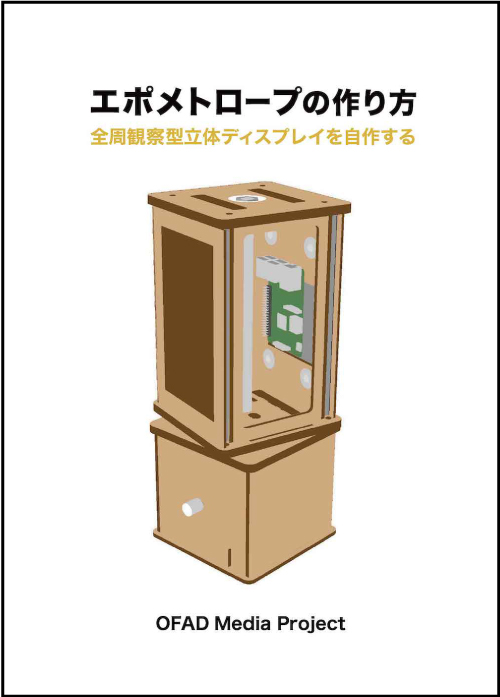

| 注意 |
:----|
| 公開されているデータはβ版になります。実際に制作を検討する際は、設計者（yutaka-miki19(at)iamas.ac.jp）まで、ご一報お願いいたします。メールなどにて制作のサポートをします。こちらから一部パーツ（MDF、3Dプリントのパーツなど）を提供した上で制作をしていただく、リモートワークショップを随時開催しています。 | 
<!-- The published data is a beta version. If you want to make this product, please contact me (yutaka-miki19(at)iamas.ac.jp). I will support you by email.-->
  
# Epometrope（Beta）
エポメトロープは、デジタルファブリケーションで制作したパーツや市販品を組み合わせて作ることができる**オープンソースの全周観察型立体ディスプレイです。「周囲360度すべての角度から観察できる立体像」をすることができ、物理空間上に3DCGがあるかのように見せることができます。**  
<!--Epometrope is an **open-source, "3D display obserbal from all directions"** that can be created by combining parts created in digital fabrication and commercially available products.**It is possible to create a 3D image that can be observed from all angles of the surrounding 360 degrees. It can make it appear as if 3DCG exists in physical space.**  -->
    
エポメトロープには既存の<a rel="license" href="https://github.com/yutaka-miki/epometorope#%E5%85%A8%E5%91%A8%E8%A6%B3%E5%AF%9F%E5%9E%8B%E7%AB%8B%E4%BD%93%E3%83%87%E3%82%A3%E3%82%B9%E3%83%97%E3%83%AC%E3%82%A4" target="_blank"> #全周観察型立体ディスプレイ </a>  に比べて以下のような特徴があります。  
- 比較的低価格で制作することができ、個人で所有することができる。  
- Raspberry PiとArduinoを採用しているので、汎用性・拡張性が高い。  
- 解像度やフレームレートが低く、細かい表現ができない。  
  
## ライセンス
現在、エポメトロープのハードウェアの制作用データ・説明書及び関連するソフトウェアは下記のライセンスに則り公開されています。  
<a rel="license" href="https://creativecommons.org/licenses/by-sa/4.0/deed.ja" target="_blank"> Attribution-ShareAlike 4.0 International (CC BY-SA 4.0) </a>  

## 紹介動画
※動画内のエポメトロープは展示のために表示部に塗装を施しています。  
https://youtu.be/bQH5cyU_22U   
  
    
https://youtu.be/xwzOMGTIUi8  
  
  
## 仕組み  
回転する表示部がセンサーにより自分の向いている方向を認識し、対応した角度の画像を表示します。これにより、 **エポメトロープの正面からみた時には正面の像が見え、左側から見れば左側の像が見えるようになります。** さらに、右目と左目に見える画像の角度や位置が異なることによる視差効果も生まれ、あたかも3DCGが中に入っているように見せることができるのです。  
  
 
  
## 材料  
https://youtu.be/bQH5cyU_22U   
オープンソースハードウェア（Raspberry Pi、Arduino）と通信販売やホームセンターなどで購入できる市販品で構成されています。  
・MDF  
・3Dプリンタ用フィラメント  
・Raspberry Pi 3b+ ×2  
・7inch Raspberry Pi LCD Touch Screen ×2  
・Arduino nano every ×2  
・ギアードモーター  
など  

## 作り方 
エポメトロープの制作手順については下記のドキュメントにまとめています。  
**『エポメトロープの作り方ー全周観察型立体ディスプレイを自作する』**   
https://docs.google.com/document/d/19RMpfx-YfTb1uZXj3RErybrc5b69bqix4a3tBb6x_-0/edit?usp=sharing  
  

## コンテンツ開発
コンテンツの開発手法について紹介します。  
現在、PC上で加工した **『専用2D映像』** をエポメトロープ内のRaspberryPiにコピーして **『3D映像』** として再生する方法を推奨しています。  
（鑑賞者に対してインタラクティブな作品を制作することも可能ではありますが、現在はまだ検証段階です。）

#### ■専用2D映像の制作方法  
  
Movie converter for epometrope  
https://github.com/yutaka-miki/Movie-converter-for-epometrope  
   
#### ■3D映像の再生方法  
  
epomeMoviePlayer  
https://github.com/yutaka-miki/epomeMoviePlayer  

#### ■その他  
epomeStreamDemo  
https://github.com/yutaka-miki/epomeStreamDemo  
  
epomeHLSResceiver  
https://github.com/yutaka-miki/epomeHLSResceiver  
  
## 作品  
『Aqualium』  
https://github.com/yutaka-miki/Aqualium

## 質問・意見
https://github.com/yutaka-miki/epometorope-hardware/issues/1

## 全周観察型立体ディスプレイ
「周囲360度すべての角度から観察できる立体像」をすることができ、物理空間上に3DCGがあるかのように見せることができます。
Seelinder

## ライトフィールドディスプレイ
全周観察型立体ディスプレイに近いジャンルとして、**ライトフィールドディスプレイ**が挙げられます。

## OFAD Media Project
https://github.com/yutaka-miki/epometorope-hardware/blob/main/OFAD-Media-Project.md 
